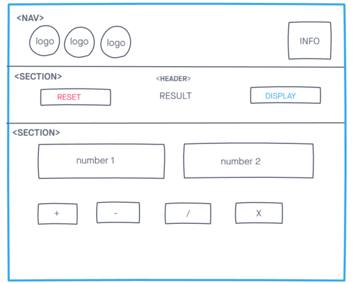

# Development Strategy

> `calculator`

A basic web page aim to learn js, debugging and developed collaboratively using branches. It's not very interesting to look at.

## Wireframe

## 0. Set-Up

### Repository

- Created a new repository [generated](https://github.com/HackYourFutureBelgium/prompt-alert-calculate)
- Clone the repository
- Copy-paste the markdown from this file to the empty `development-strategy.md` file in the new repo
- Add [this wireframe](./jswireframe-1-1.png)
- Add README file
- Starter html and css
- Push the changes
- Turn on GitHub Pages

---

## 1.

**As a site visitor, I want to see**

> assigned to `Mame`  
> reviewers `Oguz` and `Aleksandra`

## Repo

This user story was developed on a branch called `repeat_reverse_string`

### HTML

- Add h2 tags to give a title to the articles
- Add Onlick events to make element dynamics
- Add button tags

### CSS

- style article article5&6
- Add img as background
- Add font family
- Align items to center used flexbox

## JS

- wrote logic for main functions to repeat and reverse strings
- check result of the prompt function then convert to number
- Show result of input to developers via console log

## Readme

- complete readme file
